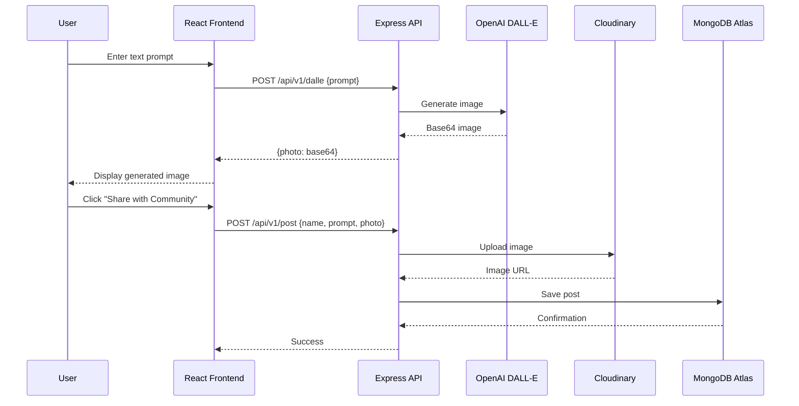

<](https://client-lake-eight-73.vercel.app)
[](https://ai-powered-image-generation-app.onrender.com)
[](LICENSE)

<br />


**A full-stack MERN application that generates AI-powered images using OpenAI's DALL-E and publishes them to a shared community gallery.**

[Live Demo](https://client-lake-eight-73.vercel.app) · [Report Bug](https://github.com/im-anwesh17/AI-Powered-Image-Generation-APP/issues) · [Request Feature](https://github.com/im-anwesh17/AI-Powered-Image-Generation-APP/issues)

</div>

---

## ✨ Features

| Feature | Description |
|---------|-------------|
| 🖼️ **AI Image Generation** | Generate images from text prompts using OpenAI's DALL-E model |
| 🏛️ **Community Gallery** | Browse and discover images created by other users |
| 📤 **Image Sharing** | Publish generated images to the community showcase |
| 🔍 **Search** | Search through posts by name or prompt |
| ⬇️ **Download** | Download any community image to your device |
| 🎲 **Surprise Me** | Get random creative prompt suggestions |

---

## 🛠️ Tech Stack

<div align="center">

| Layer | Technology |
|:-----:|:----------:|
| **Frontend** |    |
| **Backend** |   |
| **Database** |  |
| **AI** |  |
| **Storage** |  |
| **Deployment** |   |

</div>

---

## 📁 Project Structure

```
AI-Powered-Image-Generation-APP/
├── client/                      # React frontend (Vite)
│   ├── src/
│   │   ├── assets/              # Static assets (logo, icons)
│   │   ├── components/          # Reusable UI components
│   │   ├── constant/            # Prompt suggestions
│   │   ├── page/                # Page components (Home, CreatePost)
│   │   └── utils/               # Utility functions
│   ├── .env.example             # Frontend env template
│   └── vercel.json              # Vercel SPA rewrite config
│
├── server/                      # Express backend API
│   ├── mongodb/
│   │   ├── connect.js           # MongoDB connection
│   │   └── models/post.js       # Post schema (name, prompt, photo)
│   ├── routes/
│   │   ├── dalleRoutes.js       # POST /api/v1/dalle — image generation
│   │   └── postRoutes.js        # GET/POST /api/v1/post — CRUD posts
│   ├── .env.example             # Backend env template
│   └── index.js                 # Server entry point
│
├── render.yaml                  # Render deployment blueprint
├── LICENSE                      # MIT License
└── README.md
```

---

## 🚀 Getting Started

### Prerequisites

- [Node.js](https://nodejs.org/) v16 or higher
- [MongoDB Atlas](https://www.mongodb.com/atlas) account (free tier works)
- [OpenAI API Key](https://platform.openai.com/api-keys)
- [Cloudinary](https://cloudinary.com/) account (free tier works)

### 1. Clone the Repository

```bash
git clone https://github.com/im-anwesh17/AI-Powered-Image-Generation-APP.git
cd AI-Powered-Image-Generation-APP
```

### 2. Set Up the Server

```bash
cd server
cp .env.example .env    # On Windows: copy .env.example .env
```

Edit `server/.env` with your credentials:

```env
MONGODB_URL=mongodb+srv://<user>:<password>@<cluster>.mongodb.net/<dbname>
OPENAI_API_KEY=sk-xxxxxxxxxxxxxxxxxxxx
CLOUDINARY_CLOUD_NAME=your_cloud_name
CLOUDINARY_API_KEY=your_api_key
CLOUDINARY_API_SECRET=your_api_secret
PORT=8080
```

Then install and run:

```bash
npm install
npm run dev
```

### 3. Set Up the Client

```bash
cd client
cp .env.example .env    # On Windows: copy .env.example .env
```

Edit `client/.env`:

```env
VITE_API_URL=http://localhost:8080
```

Then install and run:

```bash
npm install
npm run dev
```

The app should now be running at **`http://localhost:5173`** 🎉

---

## 🌐 Deployment

### Backend → Render

1. Push your code to GitHub
2. Go to [Render Dashboard](https://dashboard.render.com/) → **New** → **Web Service**
3. Connect your GitHub repo and set **Root Directory** to `server`
4. Configure:
   - **Build Command:** `npm install`
   - **Start Command:** `npm start`
   - **Instance Type:** Free
5. Add environment variables (`MONGODB_URL`, `OPENAI_API_KEY`, `CLOUDINARY_*`)
6. Deploy — note your server URL

> 💡 Alternatively, use **New → Blueprint** and Render will auto-detect `render.yaml`

### Frontend → Vercel

1. Go to [Vercel](https://vercel.com/new) → **Add New Project**
2. Import your GitHub repo
3. Set **Root Directory** to `client` and **Framework Preset** to `Vite`
4. Add environment variable:
   - `VITE_API_URL` = your Render server URL
5. Deploy

---

## 🔑 Environment Variables

### Server (`server/.env`)

| Variable | Description |
|----------|-------------|
| `MONGODB_URL` | MongoDB Atlas connection string |
| `OPENAI_API_KEY` | OpenAI API key for DALL-E image generation |
| `CLOUDINARY_CLOUD_NAME` | Cloudinary cloud name |
| `CLOUDINARY_API_KEY` | Cloudinary API key |
| `CLOUDINARY_API_SECRET` | Cloudinary API secret |
| `PORT` | Server port (auto-set by Render in production) |

### Client (`client/.env`)

| Variable | Description |
|----------|-------------|
| `VITE_API_URL` | Backend API base URL (no trailing slash) |

---

## 🔌 API Endpoints

| Method | Endpoint | Description |
|--------|----------|-------------|
| `GET` | `/` | Health check |
| `GET` | `/api/v1/post` | Get all community posts |
| `POST` | `/api/v1/post` | Create a new post (name, prompt, photo) |
| `GET` | `/api/v1/dalle` | DALL-E route health check |
| `POST` | `/api/v1/dalle` | Generate an image from a text prompt |

---

## 📸 How It Works



---

## 👨‍💻 Author

**Anwesh**

- GitHub: [@im-anwesh17](https://github.com/im-anwesh17)

---

## 📝 Credits

This project is a fork of the [AI Image Generation App](https://github.com/adrianhajdin/project_ai_mern_image_generation) by **JavaScript Mastery**, personalized and enhanced by **Anwesh**.

## 📄 License

This project is licensed under the **MIT License** — see the [LICENSE](LICENSE) file for details.

---

<div align="center">

**⭐ If you found this project helpful, give it a star!**

Made with ❤️ by Anwesh

</div>
]]>
